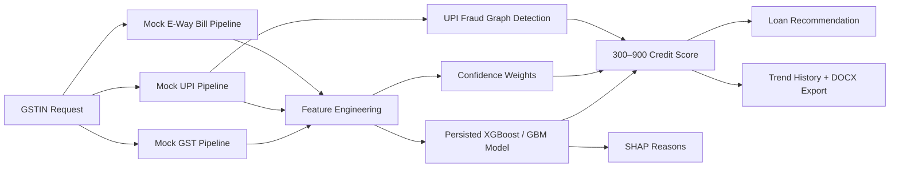

# IntelliCredit — AI-Powered Credit Appraisal Engine for Indian MSMEs

> Bridging the credit gap for India's 6.3 crore MSMEs by replacing document-heavy underwriting with real-time digital signal intelligence.

## The Problem

Banks and NBFCs reject ~80% of MSME loan applications because new businesses — under two years old — have no formal credit history, no ITR filings, and no audited financials. Conventional underwriting is built on lagging documents: GST registration certificates, Udyam papers, bank statements that are already months out of date. A 6-month-old manufacturer with ₹40 lakh in confirmed live orders receives the same rejection as an inactive shell company, because traditional models cannot distinguish between them.

Meanwhile, real-time digital footprints — GST e-invoice velocity, UPI cash-flow cadence, e-way bill volume trends — paint an accurate picture of current business health that traditional underwriting completely ignores.

## The Solution

IntelliCredit is a **full-stack AI credit appraisal platform** that consumes dynamic, near-real-time signals as primary scoring features. It produces a continuously updating credit score with full explainability — every score is accompanied by the top contributing factors in plain language, enabling a loan officer to understand and defend the decision.

### Three-Pillar Architecture

| Pillar | What It Does | Key Tech |
|--------|-------------|----------|
| **Data Ingestor** | Custom parsers for GSTR, ITR-6, 26AS, bank statements; PDF OCR for scanned docs | PaddleOCR, Pydantic schemas |
| **Research Agents** | Autonomous web scraping (MCA, eCourts, News) mapped against 20+ risk vectors | LinUCB contextual bandit orchestration |
| **Scoring Engine** | Interpretable ML scoring with SHAP explainability and fraud detection | XGBoost, CBM (PyTorch), SHAP, NetworkX |

## MSME Scoring Flow



## Key Features

### Credit Scoring API
- Accepts a GSTIN, ingests mocked live signals (GST filing velocity, UPI transaction cadence, e-way bill volume), engineers sparse-safe features, and returns:
  - **Credit score** on a 300–900 scale (CIBIL-aligned)
  - **Risk band** label (Excellent / Good / Fair / Poor / Reject)
  - **Top-5 SHAP-driven reasons** in plain language
  - **Recommended loan amount** with pricing breakdown (base rate, risk premium, sector spread)
  - **Fraud assessment** with circular transaction topology detection
  - **Score freshness timestamp**

### Sparse Data Handling
- Gracefully handles new MSMEs with as little as 3 months of history
- Population-default imputation with confidence penalties
- Automatic "manual review recommended" flag for low-confidence scores

### Fraud Detection
- **UPI circular transaction detection** via graph cycle analysis (NetworkX)
- **Round-amount clustering** to identify artificial inflation
- **Temporal pattern analysis** for suspicious transaction timing
- Flags linked MSMEs rotating funds to inflate scores

### Corporate Credit Appraisal (CAM)
- End-to-end CAM generation compressing a 2–3 week manual process into under 1 hour
- GSTR-2A vs 3B reconciliation (circular trading detection)
- Form 26AS TDS mismatch detection
- NACH bounce analysis from bank statements
- MCA director web analysis with shell company detection
- eCourts DRT/NCLT litigation flagging
- RBI Fair Practices Code-compliant adverse action notices

### Explainable AI
- **Concept Bottleneck Model (CBM):** Maps 85-dim features to 22 interpretable concepts
- **Five C's Framework:** Character (0.20), Capacity (0.30), Capital (0.20), Collateral (0.15), Conditions (0.15)
- MSME-adjusted weights (Capacity boosted to 0.40)
- SHAP waterfall visualizations for every score

## Tech Stack

| Layer | Technology |
|-------|-----------|
| **Backend** | FastAPI, Python 3.10+, Uvicorn |
| **ML/AI** | XGBoost, PyTorch (CBM), SHAP, Scikit-learn, NetworkX |
| **Frontend** | React 19, TypeScript, Vite, Recharts, D3.js |
| **Database** | PostgreSQL 16 (production), SQLite (local/demo) |
| **Infrastructure** | Docker, Docker Compose, Redis, MinIO (S3) |
| **CI/CD** | GitHub Actions |
| **Document Processing** | PaddleOCR, python-docx, OpenPyXL |

## API Endpoints

### MSME Scoring
| Method | Endpoint | Description |
|--------|----------|-------------|
| `POST` | `/api/v1/score/{gstin}` | Score a borrower — returns credit score, SHAP reasons, fraud assessment, loan recommendation |
| `GET` | `/api/v1/score/{gstin}/history` | Paginated score history (`page`, `page_size`) |
| `GET` | `/api/v1/score/{gstin}/export.docx` | Download DOCX scorecard |
| `POST` | `/api/v1/model/retrain` | Retrain and persist model artifact (admin auth required) |

### Document Pipeline
| Method | Endpoint | Description |
|--------|----------|-------------|
| `POST` | `/api/upload` | Upload 1–5 documents (auto-classifies) |
| `POST` | `/api/classify` | Classify a single document |
| `POST` | `/api/classify/batch` | Batch document classification |
| `POST` | `/api/dd_notes` | Submit due diligence notes |
| `WebSocket` | `/api/borrower/ws/{borrower_id}` | Live pipeline progress stream |

### Health & Operations
| Method | Endpoint | Description |
|--------|----------|-------------|
| `GET` | `/health` | Model backend, fallback status, version, evaluation metrics |

## Getting Started

### Prerequisites
- Python 3.10+
- Node.js v18+ & npm
- Docker & Docker Compose (for full-stack deployment)

### Quick Start (Docker)
```bash
docker-compose up --build
```
This starts PostgreSQL, Redis, MinIO, the FastAPI backend (port 8000), and the React frontend (port 5173).

### Local Development

**Backend:**
```bash
cd backend
python3 -m venv venv
source venv/bin/activate
pip install -r requirements.txt
alembic upgrade head
uvicorn app.main:app --reload
```

**Frontend:**
```bash
cd frontend
npm install
npm run dev
```

### Running Tests

**Backend regression tests:**
```bash
cd backend
source venv/bin/activate
pip install -r requirements-dev.txt
cd ..
pytest tests/test_msme_scoring_api.py
```

**Frontend tests:**
```bash
cd frontend
npm test
```

## Database Modes

| Mode | Configuration |
|------|--------------|
| **Local / Demo** | `DATABASE_URL=sqlite:///backend/data/intellicredit.db` |
| **Docker Full Stack** | PostgreSQL included and auto-configured |
| **Migrations** | `cd backend && alembic upgrade head` |

## Environment Variables

| Variable | Description | Default |
|----------|-------------|---------|
| `DATABASE_URL` | PostgreSQL or SQLite connection string | SQLite (local) |
| `DEMO_MODE` | Use fixture data instead of live APIs | `true` |
| `REQUIRE_AUTH` | Enable API key authentication | `false` |
| `API_TOKENS` | Role-based token pairs (viewer/analyst/admin) | — |
| `RATE_LIMIT_PER_MINUTE` | Request rate limit threshold | `60` |
| `MODEL_ARTIFACT_DIR` | XGBoost model artifact storage path | `backend/models/` |
| `VITE_API_BASE_URL` | Frontend API endpoint | `http://localhost:8000` |
| `VITE_API_TOKEN` | Frontend bearer token | — |

## Model Operations

**Retrain the model locally:**
```bash
cd backend
source venv/bin/activate
PYTHONPATH=. python scripts/train_msme_model.py
```

**Run a load test:**
```bash
cd backend
source venv/bin/activate
PYTHONPATH=. python scripts/load_test_msme_scoring.py --requests 25 --concurrency 5
```

## Demo Walkthrough

The platform ships with three demo GSTINs to showcase the system's discrimination and explainability:

### 1. Rejection Flow — Arjun Textiles (`27ARJUN1234A1Z5`)
- Detects 18% GSTR ITC mismatch (circular trading)
- Detects 25% Form 26AS TDS mismatch
- eCourts flags 1 active DRT case
- 3 NACH bounces detected
- **Score: 52/100 → REJECTED**
- Generates RBI-compliant adverse action notice

### 2. Approval Flow — CleanTech Manufacturing (`29CLEAN5678B1Z2`)
- GSTR and 26AS records match cleanly
- Zero litigation, zero bounces
- Healthy DSCR (1.45x), stable TNW
- **Score: 88/100 → APPROVED** with ₹5 Cr recommended limit
- Full CAM DOCX available for download

### 3. Sparse Data Flow — New Startup (`09NEWCO1234A1Z9`)
- Only 3 months of operational data
- Features imputed with population defaults and confidence penalties
- Sparse data flag raised
- **Manual review recommended**

## Project Structure

```
├── backend/
│   ├── app/
│   │   ├── main.py              # FastAPI app entry point
│   │   ├── agents/              # MCA, litigation, news agents + LinUCB orchestrator
│   │   ├── api/                 # REST endpoints (scoring, classification, upload)
│   │   ├── core/                # Settings, DB, storage, CBM, XGBoost, security, middleware
│   │   ├── fixtures/            # Demo data for rejection/approval scenarios
│   │   ├── models/              # Pydantic schemas (feature vector, GSTR, ITR, bank)
│   │   ├── parsers/             # GSTR, ITR, bank, PDF OCR, ALM, shareholding parsers
│   │   ├── rag/                 # 3-level RAG pipeline, indexer, query engine, chunkers
│   │   └── services/            # Feature engineering, fraud detection, CAM generator
│   ├── alembic/                 # Database migrations
│   └── scripts/                 # Model training, load testing
├── frontend/
│   └── src/
│       ├── App.tsx              # Main app shell with WebSocket pipeline
│       ├── components/          # Dashboard, UploadForm, PromoterGraph (D3)
│       └── components/msme/     # MSME scoring UI (ScoreHero, ShapWaterfall, FraudDetection, etc.)
├── tests/                       # Backend regression tests
├── .github/workflows/ci.yml    # GitHub Actions CI
├── docker-compose.yml           # Full-stack deployment
└── docker-compose.demo.yml      # Demo configuration
```

## Security

- Optional API-key authentication with role-based access (viewer / analyst / admin)
- Request IDs and structured logging
- Rate limiting middleware
- CORS configuration
- No secrets stored in codebase — all sensitive values via environment variables
